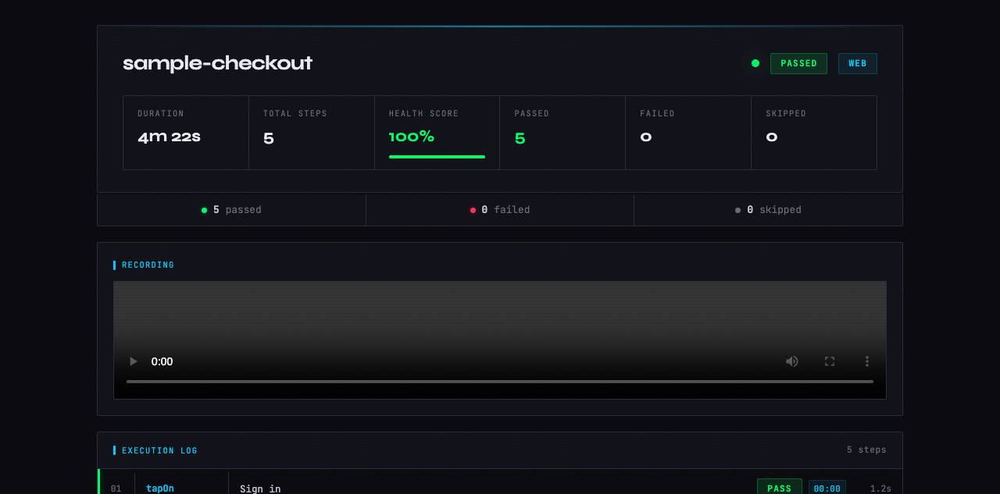
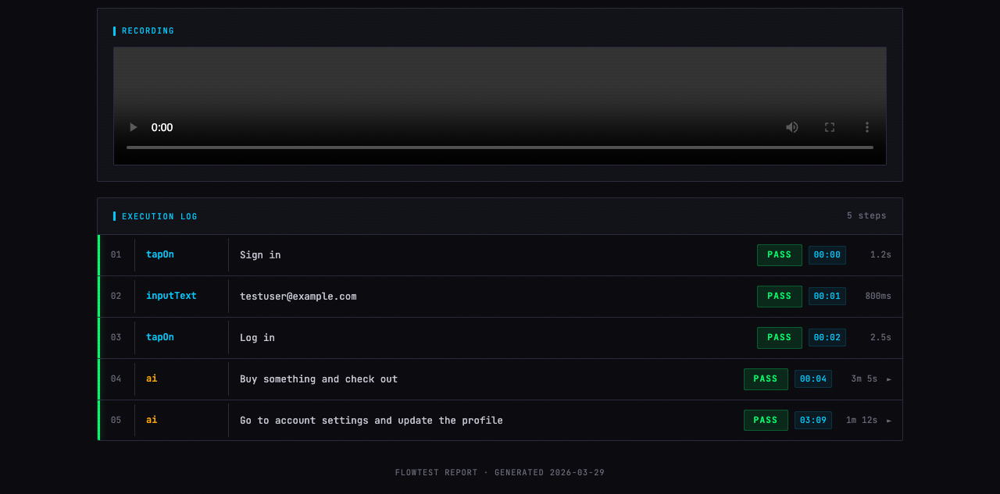
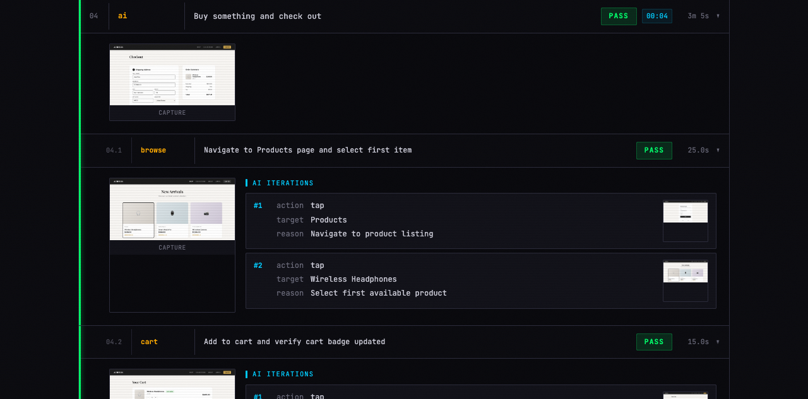
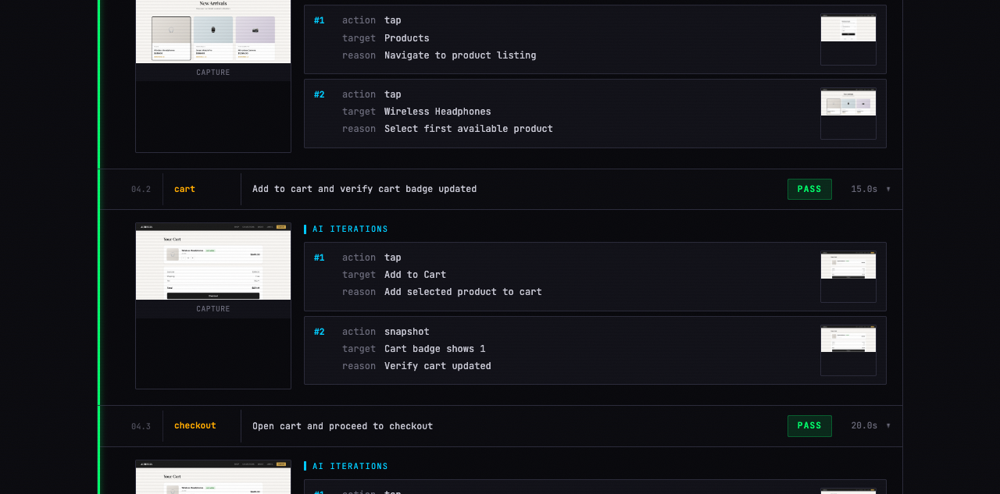

<p align="center">
  <h1 align="center">FlowTest</h1>
  <p align="center">AI-powered cross-platform test runner for web, Android, and iOS</p>
  <p align="center">
    <a href="#installation">Install</a> &bull;
    <a href="#quick-start">Quick Start</a> &bull;
    <a href="#writing-flows">Write Flows</a> &bull;
    <a href="#refine">Refine</a> &bull;
    <a href="#report">Report</a> &bull;
    <a href="#contributing">Contribute</a>
  </p>
</p>

---

Write declarative YAML steps for predictable UI interactions. Add `ai:` steps where the UI is dynamic — Claude drives those sections automatically using full context from prior steps. Get an HTML report with video, screenshots, and step timeline.

No API keys. No extra billing. No TypeScript to maintain. Uses the `claude` CLI you already have.



## How it works

```
                    ┌─────────────────────────────────────────┐
                    │              flowtest                   │
flow.yaml ────────► │                                         │ ────► report/
                    │  Declarative steps → shell commands     │       ├── viewer.html
                    │  AI steps → Claude drives with context  │       ├── recording.webm
                    │  Screenshots after every action         │       ├── results.json
                    │                                         │       └── screenshots/
                    └─────────────────────────────────────────┘
```

- **Declarative steps** (`tapOn:`, `assertVisible:`, `inputText:`, etc.) are translated directly to shell commands against the platform driver — no AI reasoning, instant execution.
- **AI steps** (`ai:`) are driven by Claude using the full context accumulated from all prior steps — screenshots, element trees, results. Claude already knows the app state.
- **Reports** include video recording (web), screenshots per step, console logs, and a self-contained HTML viewer.

---

## Installation

### Prerequisites

| Tool                                                         | Used for                | Install                                                                                   |
| ------------------------------------------------------------ | ----------------------- | ----------------------------------------------------------------------------------------- |
| [Claude Code](https://claude.ai/download)                    | Everything              | `npm install -g @anthropic-ai/claude-code`                                                |
| [agent-browser](https://github.com/anthropics/agent-browser) | Web platform driver     | `npm install -g @anthropic-ai/agent-browser`                                              |
| `adb`                                                        | Android platform driver | [Android SDK Platform Tools](https://developer.android.com/tools/releases/platform-tools) |
| `idb`                                                        | iOS platform driver     | `brew install facebook/fb/idb-companion`                                                  |
| [Node.js](https://nodejs.org)                                | Report generation       | `brew install node` or [nodejs.org](https://nodejs.org)                                   |

> Only install what you need. Web-only flows need `claude` + `agent-browser` + `node`.

### Install flowtest

```bash
# Clone the repo
git clone https://github.com/anthropics/flowtest.git

# Copy the skill folder to your Claude Code skills directory
cp -r flowtest/flowtest ~/.claude/skills/flowtest
```

That's it. The `flowtest/` skill folder contains everything — the runner skill, the refine sub-skill, report templates, and generation scripts. No extra setup needed.

After installing, `/flowtest` and `/refine` will be available as slash commands in Claude Code.

---

## Quick Start

### 1. Write a flow

Create `flows/checkout.yaml`:

```yaml
flow: checkout
platform: web
app: https://demo-store.example.com

steps:
  - tapOn: "Sign in"
  - inputText: "testuser@example.com"
  - tapOn: "Log in"
  - wait: 2000
  - assertVisible: "Dashboard"
  - ai:
      goal: "Buy the first product and complete checkout with test credit card"
      max_steps: 30
  - assertVisible: "Order confirmed"
  - screenshot: order-confirmed
```

### 2. Refine it (optional but recommended)

```
/refine flows/checkout.yaml
```

Claude asks clarifying questions about your vague `ai:` goals and transforms them into detailed, actionable instructions. See [Refine](#refine) for details.

### 3. Run it

```
/flowtest flows/checkout.yaml
```

### 4. View the report

Open `flowtest-report-checkout-<timestamp>/viewer.html` in any browser.

---

## Writing flows

Flows are YAML files with three required fields:

```yaml
flow: my-flow-name # Name (used in report directory)
platform: web # web | android | ios
app: https://myapp.com # URL (web) or bundle ID (mobile)

steps:
  -  # ... step list
```

### Step types

| Step               | Example                                   | Description                                  |
| ------------------ | ----------------------------------------- | -------------------------------------------- |
| `tapOn`            | `tapOn: "Log in"`                         | Tap element by visible text                  |
| `tapOn`            | `tapOn: {id: "submit-btn"}`               | Tap by accessibility ID                      |
| `inputText`        | `inputText: "hello@test.com"`             | Type into focused element                    |
| `inputText`        | `inputText: {text: "secret", mask: true}` | Type and mask in report                      |
| `assertVisible`    | `assertVisible: "Welcome"`                | Assert text is on screen                     |
| `assertNotVisible` | `assertNotVisible: "Error"`               | Assert text is NOT on screen                 |
| `scroll`           | `scroll: down`                            | Scroll direction: `up` `down` `left` `right` |
| `wait`             | `wait: 2000`                              | Wait milliseconds                            |
| `screenshot`       | `screenshot: after-login`                 | Take a named screenshot                      |
| `launchApp`        | `launchApp: {clearState: true}`           | Launch/relaunch the app                      |
| `stopApp`          | `stopApp`                                 | Stop the app (mobile)                        |
| `ai`               | `ai: {goal: "...", max_steps: 20}`        | AI-driven block                              |
| `when`             | `when: {platform: ios, do: [...]}`        | Platform conditional                         |

### Environment variables

Reference env vars with `$` prefix. Resolved at runtime.

```yaml
- inputText: "$TEST_EMAIL"
- inputText:
    text: "$TEST_PASSWORD"
    mask: true
```

### Platform conditionals

```yaml
- when:
    platform: ios
    do:
      - tapOn: "Allow"
  else:
    do:
      - tapOn: "OK"
```

### AI steps

AI steps hand control to Claude. Provide a `goal` describing what to accomplish and an optional `max_steps` limit.

```yaml
- ai:
    goal: "Add the first product to cart and complete checkout"
    max_steps: 25
```

**Simple goals work**, but vague goals produce inconsistent results. Use `/refine` to strengthen them before running.

### Supported platforms

| Platform  | Driver          | What it controls                         |
| --------- | --------------- | ---------------------------------------- |
| `web`     | `agent-browser` | Headless Chrome via CDP                  |
| `android` | `adb`           | Android device/emulator via UI Automator |
| `ios`     | `idb`           | iOS device/simulator via Facebook IDB    |

**Flutter web** works out of the box — Flutter generates a shadow DOM accessibility tree alongside its canvas, which agent-browser reads through Chrome DevTools accessibility APIs.

---

## Refine

`/refine` is a flow improvement assistant. It reads your YAML, asks clarifying questions about vague `ai:` goals, and generates detailed, actionable goals that produce consistent results.

### Before and after

**Before** — a vague goal:

```yaml
- ai:
    goal: "Buy something and check out"
    max_steps: 30
```

**After** — `/refine` asks questions and produces:

```yaml
- ai:
    goal: |
      Purchase the first available product and complete checkout.

      FOR EACH step:
      1. Navigate to Products page — tap "Shop" or "Products" in navigation
      2. Select the first product card
      3. Tap "Add to Cart" and verify cart badge updates
      4. Open cart and tap "Checkout"
      5. Fill shipping: Jane Doe, 123 Main St, San Francisco, CA 94102
      6. Fill payment: card 4242 4242 4242 4242, expiry 12/28, CVC 123
      7. Tap "Place Order"

      STOP when "Order confirmed" or "Thank you" appears.
    max_steps: 25
```

### How refine works

1. **Reads your YAML** and identifies all `ai:` steps
2. **Analyzes gaps** — missing assertions, screenshots, wait steps
3. **Asks clarifying questions** one at a time, across 6 categories:

| Category           | Example question                                       |
| ------------------ | ------------------------------------------------------ |
| Item mechanics     | "What types of items will the AI encounter?"           |
| Completion signals | "How will the AI know the flow is complete?"           |
| Strategy           | "Should it always choose the correct action, or vary?" |
| Side effects       | "Are there secondary events triggered by actions?"     |
| Data extraction    | "What data should be captured at the end?"             |
| Test data          | "What shipping address should the AI use?"             |

4. **Generates refined YAML** with structured goals and added declarative steps
5. **Shows diff** for your approval before writing

### Usage

```
/refine flows/checkout.yaml
```

---

## Report

Each run produces a self-contained report directory:

```
flowtest-report-checkout-2026-03-29T10-30-00/
  viewer.html           # Interactive HTML report
  results.json          # Machine-readable results
  recording.webm        # Video recording (web only)
  screenshots/
    step-00-tapOn.png
    step-03-sub-0-iter-0.png
    step-03-sub-0-iter-1.png
    step-03-sub-0-final.png
    ...
```

### Viewer

Open `viewer.html` in any browser. No server needed.

**Dashboard** — flow name, health score, pass/fail counts, duration:


**Execution log** — every step with result, duration, and timestamp:



**AI sub-steps** — click an AI step to expand. Each logical task (browse products, fill form, confirm order) is its own row with screenshots:



**Iteration details** — expand a sub-step to see every action with screenshots:



### Results JSON

The `results.json` file contains structured data for CI integration:

```json
{
  "flow": "checkout",
  "platform": "web",
  "healthScore": 1.0,
  "totalSteps": 5,
  "passedSteps": 5,
  "failedSteps": 0,
  "duration": 262000,
  "steps": [
    {
      "index": 0,
      "type": "tapOn",
      "input": "Sign in",
      "result": "pass",
      "screenshot": "screenshots/step-00-tapOn.png",
      "subSteps": []
    }
  ]
}
```

AI steps include `subSteps` with per-task breakdowns and `iterations` with per-action detail.

---

## CLI Reference

### `/flowtest`

```
/flowtest <yaml-file> [options]
```

| Option                           | Description                      |
| -------------------------------- | -------------------------------- |
| `<yaml-file>`                    | Path to flow YAML (required)     |
| `--platform <web\|android\|ios>` | Override platform from YAML      |
| `--device <id>`                  | Android serial or iOS UDID       |
| `--bundle <id>`                  | App bundle/package ID for mobile |

### `/refine`

```
/refine <yaml-file>
```

Reads the flow, asks questions, suggests improvements, writes refined YAML on approval.

---

## Project structure

```
flowtest/
├── flowtest/                    # Skill folder (copy this to ~/.claude/skills/flowtest)
│   ├── SKILL.md                 # /flowtest slash command (the runner)
│   ├── refine/
│   │   └── SKILL.md             # /refine slash command (flow improver)
│   ├── scripts/
│   │   └── generate-report.js   # results.json → viewer.html
│   └── templates/
│       └── viewer.html          # HTML report template
├── examples/
│   ├── sample-checkout.yaml     # Example checkout flow
│   └── sample-report/           # Example report with screenshots
├── docs/
│   └── images/                  # README screenshots
└── README.md
```

The `flowtest/` folder is self-contained — copy it to `~/.claude/skills/flowtest` and everything works.

---

## Contributing

Contributions are welcome. Here's how to get started:

### Development setup

```bash
git clone https://github.com/anthropics/flowtest.git
cd flowtest

# Install the skill locally for testing
cp -r flowtest ~/.claude/skills/flowtest

# Run the sample report to verify setup
node flowtest/scripts/generate-report.js examples/sample-report
open examples/sample-report/viewer.html
```

### Areas to contribute

- **New platform drivers** — support for other browser automation tools
- **Viewer improvements** — new visualizations, filtering, search in the HTML report
- **Step types** — new declarative step types (drag, long press, pinch, etc.)
- **CI integration** — GitHub Actions, GitLab CI examples and helpers
- **Documentation** — guides, tutorials, more examples

### Submitting changes

1. Fork the repo
2. Create a feature branch: `git checkout -b feat/my-feature`
3. Make your changes
4. Test with the sample report: `node flowtest/scripts/generate-report.js examples/sample-report`
5. Open a PR with a clear description

### Code style

- Keep skill files (`flowtest/SKILL.md`, `flowtest/refine/SKILL.md`) focused and well-structured
- Keep the viewer template (`flowtest/templates/viewer.html`) as a single self-contained file
- Use vanilla JS in the viewer — no build step, no dependencies

---

## License

MIT
